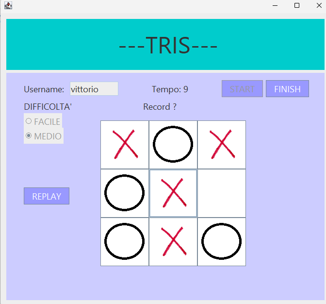

# **TRIS**
### Introduction:
This project simulates the game of tic-tac-toe between the user and the PC in a 3x3 matrix. It is made up of 2 levels: easy and medium. On easy, the PC will place the mark at random, while on medium difficulty, the computer thinks where to place the mark first to make tic-tac-toe, otherwise to prevent us from making tic-tac-toe. In the meantime, you can see the time passing and at the end, if the user wins, the record is saved with the time and the user's name.

### Inspiration:
It started as a personal challenge to train my skills with Java and the graphics side

### Download instruction:
In the release folder of the aforementioned repo, there's the .jar file that you just need to download, put in a convenient folder and launch, and then you can play tic-tac-toe, or there's a second download option on the itch page (only there you have the zip folder and you just need to extract the .jar file present as soon as you open the folder): [click here](https://vittori02-ui.itch.io/tris) 
N.B obviously the app is for Windows

### Some images of the game

.png)

